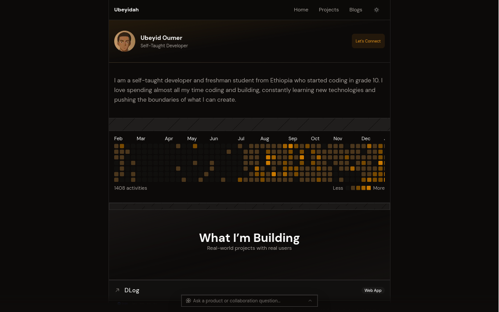

# Ubeyidah.tech

Modern personal portfolio built with Next.js App Router, featuring project highlights, writing, and contact links with a clean, fast UI.

## Live
- Website: https://ubeyidah.tech
- Blog: https://ubeyidah.tech/blog
- GitHub: https://github.com/ubeyidah

## Key Features
- **Fast, minimal UI** with responsive hero, projects, and contact sections
- **Blog system** using MDX pages with read-time estimation
- **Theme toggle** with system preference support
- **SEO-ready** metadata, sitemap, robots, and structured data
- **Analytics** via Vercel Analytics

## Stack
- **Framework**: Next.js 16 (App Router), React 19, TypeScript
- **Styling**: Tailwind CSS v4, class-variance-authority, tailwind-merge
- **UI**: shadcn/ui, Radix UI, Base UI
- **Motion**: motion
- **MDX**: @next/mdx and @mdx-js/loader

## Architecture Overview
- **App Router pages** in the app directory
- **Component library** in components, including layout sections and UI primitives
- **Blog data** defined in lib/blog.ts with read-time computed in lib/blog-posts.ts
- **MDX posts** stored per slug under app/blog
- **SEO** centralized in lib/seo.ts and surfaced via app metadata
